# Git的常用技巧

## Git常见的几个概念

1. 远端中心库：是指所有开发者共同维护的一个代码仓库，包含所有人员的代码，用于版本发布，这个仓库是需要对外发布或者共同使用的哦，很重要

2. 个人远端库：个人通过fork中心库或者个人在代码仓库上创建的代码仓库，一般用于将个人对于中心库的修改向中心库进行merge，也就是将自己的修改提交到中心库，由中心库的maintainer进行审核然后合入

3. 个人本地库：个人通过本地init代码仓库，或者git clone远端仓库在本地创建的代码仓库，一般会与中心库保持一致，保持始终在最新的代码上进行修改，防止代码冲突，即code conflict

4. 缓存：本地的代码修改，在没有commit到本地的代码仓库之前，会存在缓存内，直到开发人员提交到本地的代码仓库  

***

## 常见的工作流程
### Step 1：个人远端与中心仓库
明确三个代码仓库的区别，然后从中心代码仓库fork个人的远端仓库，此处以gitlab为例，如下：
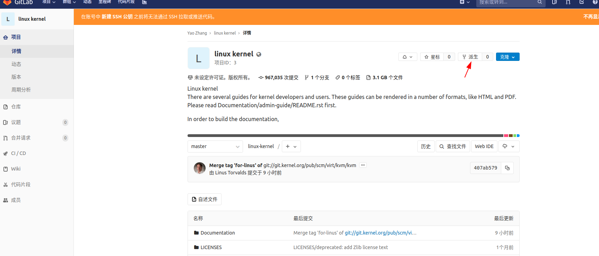

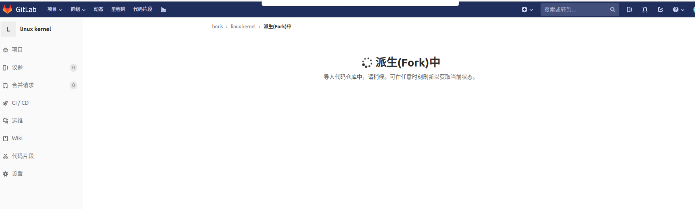

然后就会在个人的项目内创建一个代码仓库，这个仓库在没有个人提交代码之前，始终保持与中心库一致，在个人作出修改之后则会每次按照个人提交的本地代码保持一致

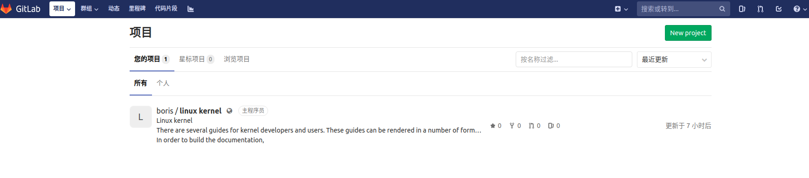

### Step 2:本地与中心仓库
在创建个人的远端仓库以后，我们需要拉取一份中心库的代码到我们本地，方便我们进行修改以及提交，这种时候我们可以选择采用clone中心库的方式获取中心库的代码，我们需要先获取中心库的git地址，如下：
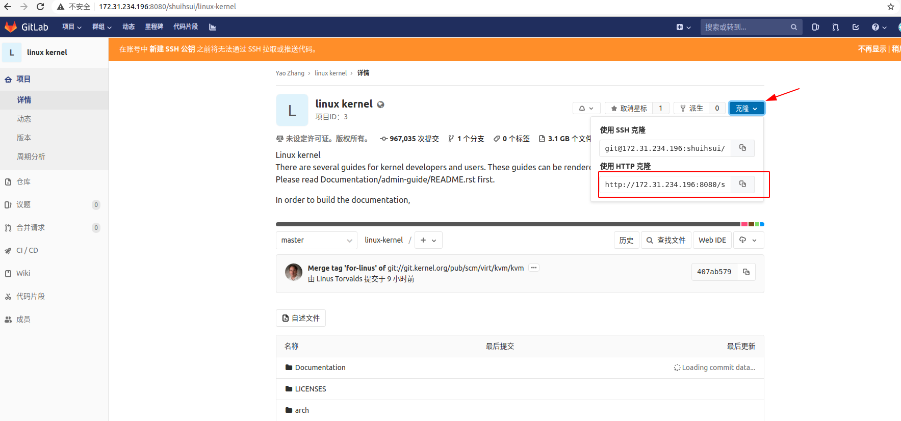

我这里使用的是命令行拉取代码，命令如下:
> git clone http://172.31.234.196:8080/shuihsui/linux-kernel.git

拉取过程如下：
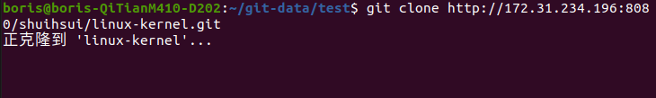

拉取完成后，会在本地存在一个包含源代码的文件夹，如下：

至此，我们就建立了我们本地和中心库之间的联系，以及我们个人远端库和中心库之间的联系，但我们本地和个人的远端库之间还缺少联系，所以我们的任务还没有完成哦～～

### Step 3：个人远端与本地
建立本地与个人远程库之间的联系，首先查看自己本地代码仓库所拥有的remote的地址，命令如下：
> git remote show

此处应当显示的为clone的中心库，默认为origin，因而我们还需要再添加一个个人远程库，命令如下：
> git remote add + 个人远程库的别称 + 个人远程库的地址

此处个人远程库的别称是为了和中心库的origin进行区分，个人的远程库的地址则可参照之前的中心库的获取方式，最后结果如下：

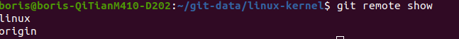

至此，我们三个代码仓库之间的联系已经创建完了，以下是流程简示：
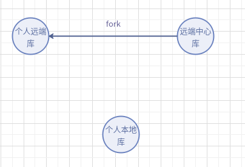
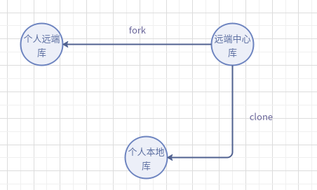
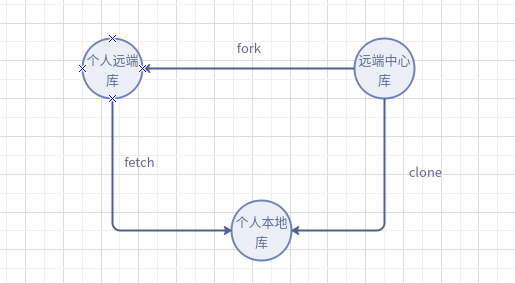

***

## 代码修改提交的流程

### Step 1：保持本地仓库与中心库一致
首先在修改本地的代码之前，我们需要保持本地的代码与中心库的代码保持一致，这里我们可以先pull一下中心库的代码，命令如下：
> git pull origin master

### Step 2:提交代码到本地仓库
我们在保持本地和中心库的代码一致以后，就可以在本地的代码基础上进行修改了，我们这里的修改都会存在git的cache里面，也就是没有纳入到版本控制里面,所以我们需要将我们本地的修改纳入到版本控制里面，也就是将我们git cache里面的修改进行git add以及git commit，命令如下：
> git add *

> git commit "本次修改的内容简述"

进行如上两步操作以后，我们的第一步就完成了，可以通过git log来查看自己本地版本控制的记录，如下：
> git log

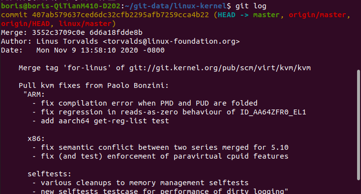

这里有一串Merge显示的串，这是通过hash算出来的，保证每个人每次提交的唯一性，从而可以用于版本代码回退等操作，而接下来的则是commit的内容

### Step 3：推送代码到个人远端
在推送我们本地的代码到我们的个人远程库之前呢，我们需要保证我们能安全无误的提交我们的代码，防止其他人向我们的个人远程库提交代码，或者我们提交过程中被修改等等，所以我们需要在我们的gitlab中添加我们的ssh key

这里我们需要生成ssh key，打开命令行，输入以下命令：
> ssh-keygen -t rsa -C "邮箱地址"

执行以上命令以后，会在我们本地生成公钥，可以进入以下目录寻找  
路径：～/.ssh/  
我们需要拷贝id_rsa.pub内的内容，然后回到我们gitlab，登录以后进入Setting->SSH KEY,将我们拷贝的公钥内容粘贴到这里，然后我们的公钥就添加成功了，就可以push本地的代码到我们的个人远端了  
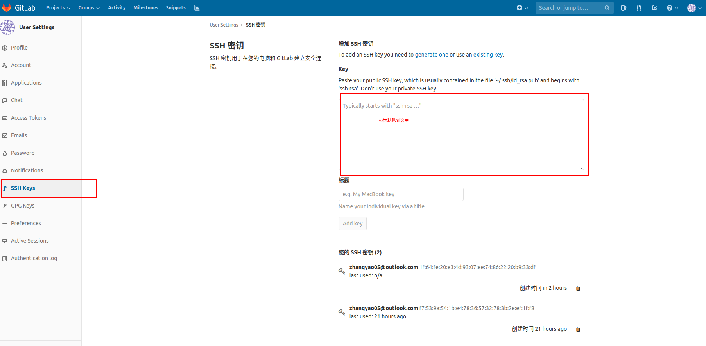

提交我们的代码到我们的个人远程库，这个时候就需要我们通过git push命令来推送代码了，命令如下：
> git push (可选参数-f) + 个人远程库的别称 + master

这里的个人远程库的别称就是我们之前在git remote show中看到的origin或者remote_boris之类的

### Step 4:个人远端向中心库提交代码
此时我们的本地仓库和我们的个人远端代码保持一致，我们现在需要从我们的gitlab的个人远端向中心仓库提交合库请求，如下：

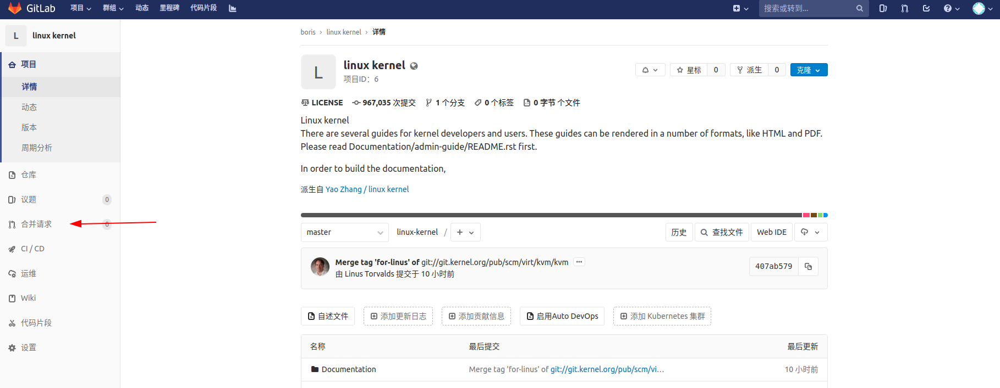  

我们进入到新建合库请求的页面，然后新建request

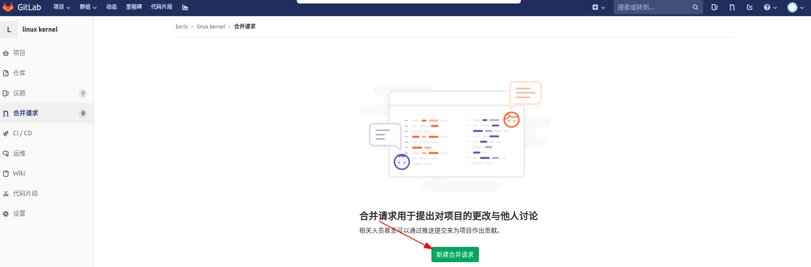

然后我们比较我们个人远端与中心库之间的区别，然后提交

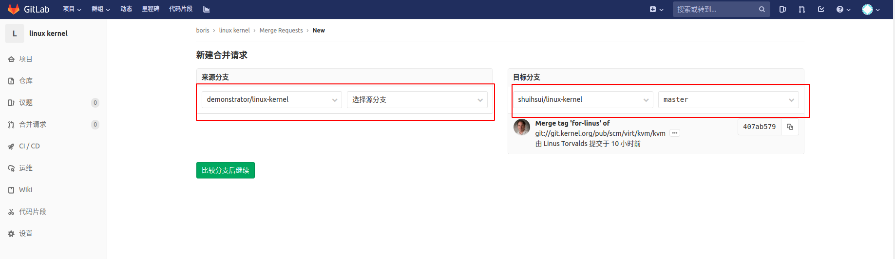

PS：这里我们需要选择正确的仓库以及分支，这个很重要哦，提merge之前一定要确定好，因为在实际的生产中可能会存在很多分支，每个分支存在的作用各不相同，比如测试分支、版本分支等等

接下来，我们需要为这次的合库请求填入合适的信息，从而告诉中心库的维护者你这次提交的修改是关于什么方面的，比如bug修改、新需求等等，一定要简明扼要哦～～
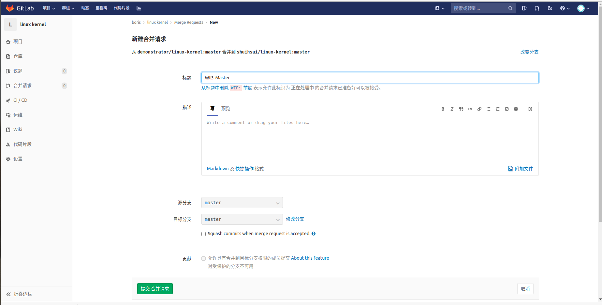

然后点击提交就ok啦，剩下的则是交给中心仓库的维护者来进行代码review，然后合入中心库就可以了哦，当然，如果中心仓库的维护者发现你的代码不合他的心意，存在编码风格，或者bug之类的问题，可能会将merge请求打回，这个时候就需要你根据问题来进行修改然后重新进行上面的步骤，所以在合入代码之前一定要对自己的代码负责哦

以下就是针对代码提交过程的简示：  
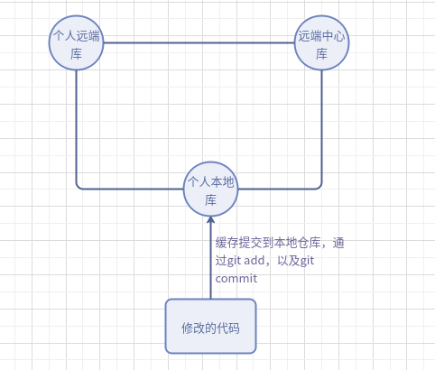
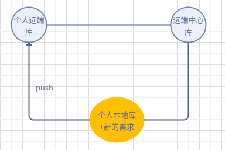
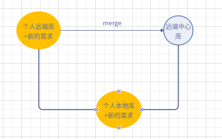
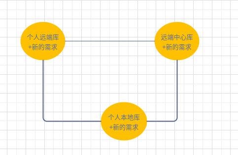